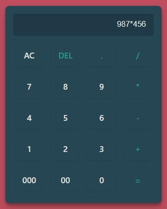

<h1 align="center">
    
</h1>

Vue 3 Calculator

<h4 align="center"> 
	- Status: ✅ -
</h4>

## ☑️ Sobre
---

Calculadora desenvolvida com vuejs, javascript e css.

### 🔌 Como rodar o projeto | Local
---
Caso queira rodar o projeto local, você deve rodar os seguintes comandos:

### Acesse o diretório
`cd vuejs-calculator`

### Instale as dependências
`npm install`

### Execute o projeto em desenvolvimento
`npm run dev`

### Depois de iniciar o projeto em desenvolvimento, basta acessar http://localhost:3000/

### Proximos passos
 * Monitoramento de teclas pressionadas.
 * Histórico de calculos

### 🔋 Tecnologias
---
- [Vue](https://vuejs.org/)
- [Vite](https://vitejs.dev/)

### 🎲 Feito por
---

<a href="https://github.com/juniorhbs">
 
  
 

 <b>Junior Oliveira</b></a> <a href="https://github.com/juniorhbs" >💻</a>

 
